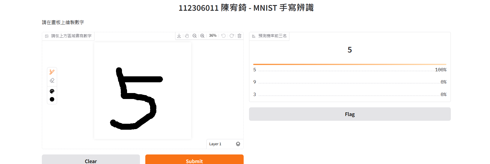

# MNIST Handwritten Digit Classifier

是一個 **4 層深層神經網路 (DNN)**，用於辨識 MNIST 手寫數字集。透過超參數優化與架構調整，最終在測試集達到 **97.96%** 的準確率。

##  專案亮點
- **架構設計**：採用 512-256-128 遞減式隱藏層結構。
- **效能優化**：使用 **Adam** 優化器與 **Categorical Crossentropy** 損失函數。
- **數據分析**：利用 **Pandas** 進行探索性資料分析 (EDA) 與訓練歷程監控。
- **互動介面**：整合 **Gradio** 打造即時手寫辨識 Web UI。

## 實驗結果
| 版本 | 架構 | 優化器 | 正確率 |
| :--- | :--- | :--- | :--- |
| V1 (Base) | 20-20-20 | SGD | 85.2% |
| **V3 (Final)** | **512-256-128** | **Adam** | **97.96%** |

## 介面展示

